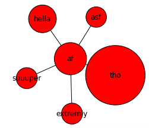
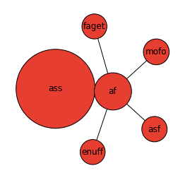
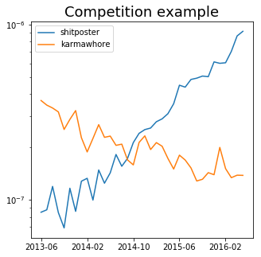

My current research is concerned with the relationship between the social and semantic context of lexical innovations and their likelihood of adoption in the online community Reddit. The innovation "fleek" (from [on fleek]()) gained success due to its restricted context, i.e. the phrase ["on fleek"](https://www.youtube.com/watch?v=XrTVMXxop3o), but this might be a rarity compared to most innovations that might gain success as a result of being used in a wide variety of contexts. Unlike "fleek," the intensifier "af" ("as fuck") seems to occur in a wide range of post-adjective contexts ("cool af", "dope af", etc.). Related to work on adoption of innovations like [this](https://dspace.lboro.ac.uk/dspace-jspui/bitstream/2134/21665/3/Kershaw%20rowe%20stacey%20ACM_proc.pdf) and [this](http://publications.aston.ac.uk/28001/1/ELL_078_Grieve_Nini_Guo_final.pdf), it seems like there is a nontrivial relationship between the linguistic context of a new word and the likelihood of that word being adopted by a community. But how do we study that relationship quantitatively? It's not easy to come up with a universal definition of "context" apart from the generic ["company that you keep" definition](http://www.tandfonline.com/doi/pdf/10.1080/00437956.1954.11659520), and this still leaves a lot of room for interpretation.

One way to operationalize this is to define a word's "context" as its semantic context, meaning the existence of semantically similar words. The word "af" may occur in similar situations as standard intensifiers "very" and "really," and therefore it may have to "compete" with these standard words in order to gain acceptance. This is a hypothesis that has typically been hard to test because it requires manually defining all the competing words as in the [case of quotatives](https://www.researchgate.net/profile/Alexandra_Darcy/publication/231871295_Frequency_and_variation_in_the_community_grammar_Tracking_a_new_change_through_the_generations/links/55b2421d08aec0e5f43167fd.pdf). 

One way to get around this issue is with a natural language processing technique known as word embeddings, which allow us to learn about lexical competitors directly from our data: e.g. determining automatically that "af" is competing with "very" and "really." At the high level, a word embedding model tries to capture lexical semantics by projecting all the words in a corpus into the same high-dimensional vector space and then minimizing the distance between vectors of words that occur in similar contexts - in our example, minimizing the distance between intensifiers "af" and "very" based on their occurrence near adjectives. I give an example in the plot below where I've trained a model using Reddit data, then visualized "af" and its nearest "neighbors" in the same 2-D space and sized them according to their frequency. Note that the nearest neighbors include "hella", "suuuper", and "extremly" which occur in a similar adverb-ish neighborhood as "af."

One of the many interesting aspects of word embeddings, and NLP in general, is how different models account for different aspects of semantic relationships. For example, the "typical" [`word2vec` model](http://papers.nips.cc/paper/5021-distributed-representations-of-words-and-phrases-and-their-compositionality.pdf) that I used above defines a word's context as an unordered "bag" of context words. For instance, in the phrases "that shirt is cool af !" and "that shirt is really cool !", both "af" and "really" have similar 2-word context "bags" {"is" "cool" "!"} and {"shirt" "is" "cool" "!"}. However, some models like the [structured skip-gram](http://www.cs.cmu.edu/~lingwang/papers/naacl2015.pdf) try to capture more syntactic word patterns by treating context as an ordered list of words rather than an unordered "bag" of words. For example, in the phrases "that shirt is cool af !", "that shirt is cool asf !", and "that shirt is really cool !" both "af" and "asf" have the same 1-word context ["cool" "!"] but do not have the same context as "really", ["is" "cool"]. This might seem trivial but it actually changes how the model learns about semantic "similarity". In the first embedding model "af" may be closer to standard intensifiers like "really" and "very" because they all occur in the same unordered "neighborhood" as adjectives, but in the second model "af" may be closer to post-adjective words like "asf" or "ass" (as in "a cool ass car") because of how the second model treats "context" as strictly related to word order. You can see this for yourself in the plot below where I've visualized "af" and its nearest neighbors based on the structured model.[1](#footnote1)

I don't want to say that one embedding model is inherently better than another but rather that some models treat lexical "semantics" as more of a syntactic rather than purely contextual problem. There's even [wackier models](https://arxiv.org/pdf/1503.00185.pdf) that actually use syntactic parse data to build embeddings, but the nature of the data (Reddit) makes parses unreliable at best and comical at worst so I decided to stick with the "normal" model and the structured model.

At the end of the day, where does all this machine learning get us? In the case of the syntactically-aware model, it gives us a method to generate likely word competitors based on their shared semantics and syntax in a way that avoids needing domain knowledge and subjective judgments. By narrowing our idea of "context" to "words that occur in similar situations," we have operationalized our research question in a way that lets us leverage natural language processing. So we can now start to ask questions about how a word's context influences its likelihood of adoption: when we see a new word like "af", how much should we bet that its semantic context will affect its likelihood of adoption? 

I'll end this post with one of the favorite graphs I've generated so far, which shows how the up-and-coming "shitposter" has eclipsed one of its neighbors "karmawhore" (determined from the structured embeddings) from 2013 to 2016.

Next time, I'll talk about another definition of "context" which is less fancy but, it turns out, a whole lot more useful for studying word adoption and abandonment.

<a name="footnote1">1</a>: You might think that getting here was easy, but there's a lot of data cleaning and number crunching that I've swept under the rug because I wanted to get to the fun stuff. 