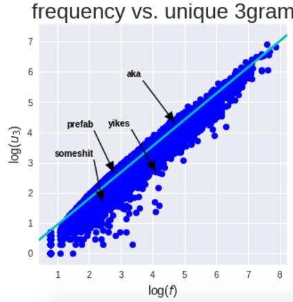
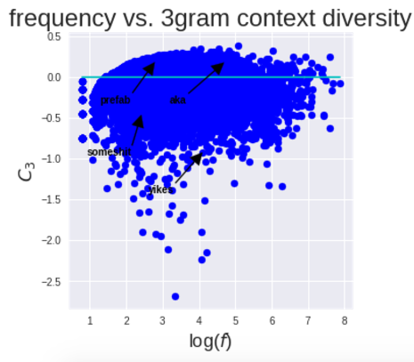
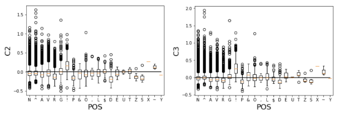
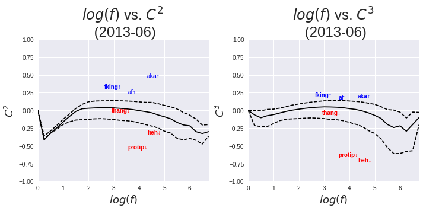

As I mentioned last time, my current work is concerned with how linguistic and social context influence the likelihood of a new word's adoption. Last time I talked about semantic context as the popularity of a word's "nearest neighbors" and how that might play a role in word adoption.

The short answer to that question is that the "nearest neighbor" definition of context doesn't play as big a role as you might think. For instance, if you use neighbor popularity to predict whether a word will grow or decline over time, the accuracy isn't high enough to justify its use as a predictor. Using neighbor popularity on its own without respect to time, we find that it can differentiate different kinds of words, such as respellings like "ur" which has significantly more popular neighbor "your." As a side finding, I also figured out that neighbor distance (in vector space) is a pretty bad predictor of polysemy which contradicts [some previous work](https://arxiv.org/pdf/1605.09096.pdf). But neighbor popularity does not seem to influence the likelihood of a word's adoption, which to me seems like an interesting null result but not enough to build any hypotheses from.

So what's another way to think about context? Without resorting to machine learning, we can make context even simpler and consider a word's context to be the unique number of fixed-word phrases in which it occurs. In the sentence "this is cool af !", the word "af" occurs in 2 unique bigram contexts: ["cool" "af"] and ["af" "!"]. This seems like a foolproof measure but it turns out to be highly correlated with frequency, i.e. words that have a high frequency also tend to occur in a high number of contexts, as you can see in the plot below (thank you, [Heap's Law](https://en.wikipedia.org/wiki/Heaps%27_law)).

How do we find the words with an especially high or low number of contexts? One way to get at this extra info is to establish an "expected" number of contexts and then compute the difference between the expected and actual number of contexts, i.e. the residual. If we fit a function between the independent variable (frequency) and dependent variable (unique contexts), then we can use the residual between the function's predicted value and the actual dependent variable. This can help separate the words that occur in an unusually high number of contexts, such as "aka", from a word with similar frequency that occurs in an unusually low number of contexts, such as "yikes." You can see this in the plot below.

Cool! Does this measure shed any light on different word categories? Take different parts of speech, for example. An adverb like "af" would have a lower range of contexts (e.g. only post-adjective) compared with an exclamation such as "yikes" that has fewer syntactic constraints. After tagging the corpus for POS tags using [this handy program](https://github.com/brendano/ark-tweet-nlp), we found that there was a considerable degree of variation in context diversity across part of speech tags. Compare, for example, the higher context diversity of exclamations (marked "!") compared to the adverbs (marked "R") in the plot below, where C2 indicates bigram context diversity and C3 indicates trigram context diversity.

More importantly to our study: does context diversity help us determine whether a lexical innovation will succeed or not? The short answer is more often than not, yes. After picking out a set of lexical innovations that grew and innovations that declined in frequency over the course of the observed timespan (2013-2016), we found that context diversity was the most consistently strong factor in separating the growth words from the decline words, after matching them on frequency. You can see the separation in the plot below, where the successful (growing) innovations "fking," "af", and "aka" have a higher initial context diversity than the unsuccessful (declining) innovations "thang", "protip", and "heh."

Why might this be the case? One hypothesis is that innovations that are "on the way in" (such as "af") are more lexically flexible than innovations that have already seen their prime and are on the way out (e.g. "protip"), which may result in being used in certain fixed expressions rather than flexible expressions (i.e. fewer contexts). This falls in line with Metcalf's FUDGE model (Metcalf 2004) that proposes a "generative" quality for innovations that allows them to extend to a wide range of contexts. 

The ovearching goal of this project is to compare linguistic context with social context with respect to the adoption of lexical innovations. Our preliminary tests have shown that linguistic context diversity, as measured with the residual-calculation method, is a significantly stronger predictor of success than social context. To me, this suggests that studies that examine innovations but only look at social context are missing out on some important factors. It's particularly interesting in light of the current focus on social networks as a explanatory mechanism for the adoption of trends like linguistic innovations (e.g. [this study](https://arxiv.org/pdf/1609.02075.pdf) by my friend Sandeep). 

Shouldn't innovation studies, like social network diffusion research, also consider linguistic form and context in addition to social factors? And thinking more broadly, can we abstract this idea to apply to non-linguistic innovations? For example, how do we quantify the diversity of contexts to which a meme applies (quantifying the idea of [templatability](https://www.microsoft.com/en-us/research/wp-content/uploads/2016/02/21Rintel-2013-CrisisMemes-AJPC.pdf))? Not sure there's an easy answer, but something worth pondering.

In so many words, that's the second definition of linguistic context: the relative number of unique bigram and trigram contexts in which a word appears. Seems basic but it points to some unexpected trends. If you can find a study that uses this metric or a similar idea, let me know! I haven't been able to find anything outside of passing mentions in corpus linguistics and machine translation, which aren't especially helpful.

We're currently writing up these results into a paper submission, so hopefully this publication will be out soon (coming to an open-access journal near you)!