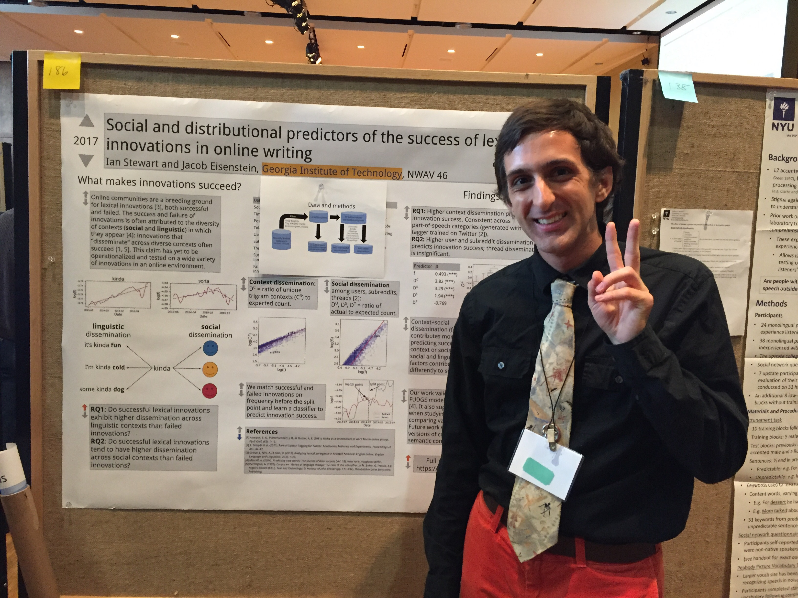

I've just returned from [NWAV 2017](https://english.wisc.edu/nwav46/), a conference centered around language variation and change. Although I'm technically focused on social computing, my research looks at situations of language change in online communities, like what makes certain lexical innovations survive longer than others. In the work I presented at NWAV ([poster here](../docs/NWAV_2017_poster.pdf)), I found that lexical innovations on Reddit are more likely to succeed when they have higher dissemination among social and linguistic contexts. Here is photographic evidence of my presentation, documented by [Emily Sabo](https://emilyraesabo.squarespace.com/)!

## Interesting relevant papers

I received a lot of good feedback on the project and I also got a chance to give feedback on some other interesting works in quantitative sociolinguistics. Unfortunately most of the presentations are not available online yet, so I can only provide a brief summary. Here were a few related to internet language usage that I found interesting. 

- Dunn, J. "Finding variants in a dynamic feature space: classification as validation." 
Abstract [here](https://english.wisc.edu/nwav46/wp-content/uploads/2016/09/NWAV-46-Booklet-Nov3.pdf#page=116).
Grammatical constructions can vary across social groups, but we often only consider the most obvious constructions such as "[needs washed](https://web.stanford.edu/~gdoyle/papers/doyle-2014-eacl.pdf)." Dunn applies induction of grammatical constructions to a variety of regional English web corpora and finds that the distribution of constructions can accurately classify documents' region of origin. Still looking for the full paper!

- Bleaman, I. "Variation in Hasidic Yiddish syntax: A corpus study of language change on the internet."
Abstract [here](https://english.wisc.edu/nwav46/wp-content/uploads/2016/09/NWAV-46-Booklet-Nov3.pdf#page=80).
People learning minority languages such as Yiddish often turn to online forums as a space to practice the language and interact with native speakers. Bleaman studies the variation in use of [particle verb](https://en.wikipedia.org/wiki/Phrasal_verb) constructions across users of an active online Yiddish forum. Interestingly, the increase in the frequency of the nonstandard variant over time appears to be driven by newcomers, who later abandon the nonstandard in favor of the standard. A corroboration of my earlier [work on orthographic variation](../docs/DiVar_2017.pdf) on Instagram!

- McCulloch, G., LaMontagne, J. "Troppppp loooongueuuhhhh: Orthographic lengthening across French dialects."
Abstract [here](https://english.wisc.edu/nwav46/wp-content/uploads/2016/09/NWAV-46-Booklet-Nov3.pdf#page=176).
Orthographic variation is rampant on the internet (surprise) and has been shown to convey meaning in social interactions, e.g. [expressivity](https://www.indiana.edu/~iulcwp/wp/article/download/08-22A/160). It is less well-known whether it reflects different pronunciation patterns across dialects. By collecting variant data across different dialect regions throughout France and Canada, McCulloch and LaMontagne show that orthographic lengthening typically affects vowels, even non-finally, and the regional differences in vowel quality affect the likelihood of lengthening. 

- Jones, L. "AAE Intensifier Dennamug: Syntactic Change in Apparent Time."
Abstract [here](https://english.wisc.edu/nwav46/wp-content/uploads/2016/09/NWAV-46-Booklet-Nov3.pdf#page=152).
The internet has revealed a surprising fact about language change: it can happen quickly and with unexpected patterns. An example is the apparently new intensifier "dennamug," derived from the phrase "than a motherfucker" (e.g., "it's colder dennamug out here"). Using Twitter data and a wide range of spelling variants, Jones finds that "dennamug" has expanded to include not only adjectives, as expected of an intensifier, but also adverbs and nouns (e.g., "leisurely dennamug"), suggesting that syntactic innovation may not always proceed in the most obvious way.

These works were most relevant to my interests in sociolinguistic variation on the internet, and there's lots more to be said about each of them. For those reading, let me know if you find the slides/posters for these projects!

## Interesting non-relevant papers

I also spent a lot of time listening to talks that were irrelevant to my main interests but still really interesting for a more broad sociolinguistics perspective. One of the biggest emerging themes I saw was a return to perceptual studies as opposed to the typical change-over-time approach. Here were some of the most interesting perceptual studies that I was able to attend:

- Holliday, N., Villareal, D. "How Black Does Obama Sound Now? Testing Listener Judgments of Intonation in
Incrementally Manipulated Speech."
Abstract [here](https://english.wisc.edu/nwav46/wp-content/uploads/2016/09/NWAV-46-Booklet-Nov3.pdf#page=145).
We know that people judge other people based on how they sound, even when they cannot physically see the other person: this plays a huge role in housing discrimination, since some landlords will [deny housing applications](http://journals.sagepub.com/doi/pdf/10.1177/10780870122184957) based on the applicant's dialect. Holliday and Villareal investigate prosodic intonation (an understudied aspect of African American English) and specifically how it affects the perception of a speaker's "blackness." By manipulating the extremity of intonation in clips of Obama speaking, the authors find that more extreme intonation in low-high stress patterns correlates with higher ratings of blackness, suggesting an incrementation effect in perceived dialect features.

- Preston, D. "The soft underbelly of sociolinguistics – NOT!"
Abstract [here](https://english.wisc.edu/nwav46/wp-content/uploads/2016/09/NWAV-46-Booklet-Nov3.pdf#page=203).
Perceptual dialectology is often considered the "soft underbelly" of sociolinguistics because of its reliance on conscious/subconscious speaker understanding of phonology, rather than studying speaker production. Studying how people understand dialects is messy! But Preston offers a brilliant defense of the importance of perception to understand how speakers mentally organize their own dialect, as his prior work has found that dialect speakers often maintain an internal phonology of the standard dialect even as they produce nonstandard variants. Really cool work at the intersection of sociolinguistics and cognitive processing.

- Beltrama, A., Casasanto, L.S. "*Totally* and *-issimo*:
Intensification, indexicality and markedness in English and Italian"
Small abstract [here](https://english.wisc.edu/nwav46/wp-content/uploads/2016/09/NWAV-46-Booklet-Nov3.pdf#page=56), full paper on similar work [here](https://andreabeltrama.files.wordpress.com/2017/05/beltrama_et_al-2017-journal_of_sociolinguistics-1.pdf).
A fundamental assumption of variationist sociolinguistics has been an asymmetry of form and function: two variant forms (e.g., "totally" versus "completely") may be different but still have the same underlying semantic function. However, the semantic value of some words cannot be fully understood without a corresponding social value, such as the use of "totally" as both an intensifier ("totally cool", semantic) and emphasizer ("I totally went there", social/pragmatic), which requires a symmetry of form and function. Looking at the intensifiers *totally* and *-issimo*, Beltrama and Casasanto elicit perceptions of test sentences that contain one of the intensifiers or a control "variant" and find that the variant intensifiers, when used in certain semantic contexts, do carry social meaning as judged by perceptual ratings like "less educated" and "more cool" (I can't remember the exact categories).

So many more papers I could talk about, but I'll cut myself off. Perception of language variation is a rich and open research space that I'm going to keep my eye on.

## Academic communities

Recently I've trying to write about more "fuzzy" topics like what it means to be part of a community, so here's my first attempt.

One thing that I've missed as part of a computer science program is the feeling of a distinct academic community. 
Because the field of natural language processing is so big, it can be hard to figure out the boundaries and structure of the field.
Returning to a smaller field like variationist sociolinguistics reminded me of how fun the community can be.
One community norm that I especially enjoyed was the wordplay: since linguists are often word nerds, puns abounded and even led to some amusing [spoonerisms](https://twitter.com/jessgrieser/status/926970513221660673).

More seriously, I enjoyed the commitment to engagement outside the field that more linguists are trying to invest in.
The screening of Walt Wolfram's movie on African American English in America (["Talking Black in America"](https://www.talkingblackinamerica.org/)) led to great discussion on how to get non-linguists interested in serious issues like racial discrimination.
John Rickford also led a terrific discussion on how linguists need to be more committed to social justice more broadly, since our studies cannot do much good alone if they are not accompanied by substantive action to, e.g., address [educational inequality](http://www.johnrickford.com/Writings/PapersAvailableOnline/TheOaklandEbonicsDecision/tabid/1140/Default.aspx).
Although I don't know exactly what I can do to help with this engagement, I would like to spread knowledge to a more public audience and encourage people to celebrate, not denigrate, dialect usage.

I would like to see a similar level of engagement in natural language processing and data science in general.
The frequent focus on task-driven application, such as [detecting hate speech](https://www.cc.gatech.edu/~eshwar3/uploads/3/8/0/4/38043045/chi2017-chandrasekharan-boc.pdf), is commendable and tied to real-world consequences.
However, so many of those applications seem to belie a genuine commitment to larger social issues: for instance, can the NLP community contribute to larger and more political efforts to make the internet a "better" place?
Can we have a meaningful conversation about the limits of our "tasks" and how to broaden the scope to include a bigger slice of human behavior, like language variation?
I think that we can, and we should.