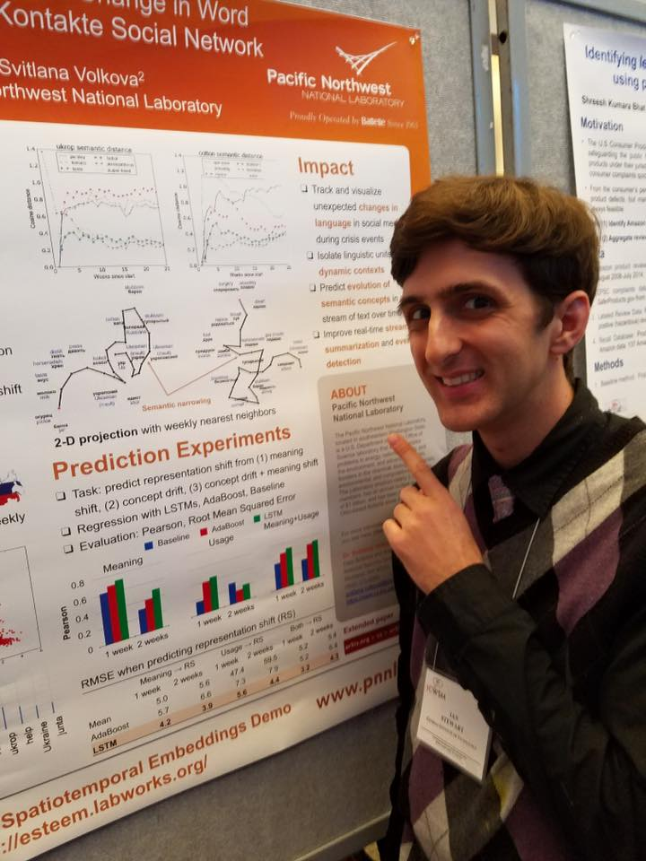

From May 14-18, I recently attended the [International Conference for Web and Social Media](http://www.icwsm.org/2017/) in Montreal to present my work on semantic change that I conducted during my internship at the [Pacific Northwest National Laboratory](http://www.pnnl.gov/) during summer 2016. Check out the full paper [here](https://arxiv.org/abs/1703.07012) and the poster [here](http://ianbstewart.github.io/docs/ICWSM_2017_poster.pdf)!

Since it was my first large-scale conference of grad school, I tried to take in as much as possible. I particularly enjoyed the workshop on [Observational Studies Through Social Media](https://www.microsoft.com/en-us/research/event/ossm17/), which was a nice introduction to causal inference methods like matching. The gist of the methodology is to approximate a randomized experiment using observational data through methods that reduce the potential for confounds affecting the treatment and outcome. Propensity score matching is a nice example of causal inference as it matches "treatment" with "control" users based on similar attributes (example below). It helps researchers tackle tricky questions such as the [influence of social support on suicide ideation](http://www.munmund.net/pubs/icwsm17_SocialSupport.pdf).

I tried to take as many notes as possible on the talks and panels, and I'm hosting the notes [here](https://docs.google.com/document/d/1Gz0ObQI4oEywrymiwjl1DHmmhW4eqodE0l0ULdzcP40/edit?usp=sharing). Check them out if you're interested! There weren't as many language-centric studies as I had hoped but I still enjoyed the variety of topics covered, from [emoji semantics](https://aiwei.me/files/icwsm2017-ai.pdf) to [community identity](https://web.stanford.edu/~jurafsky/pubs/paper-identity.pdf). 

Overall, I most enjoyed exchanging wacky research ideas with other students and faculty, particularly at informal events like the [Science Slam](https://sites.google.com/site/icwsmscienceslam/) where I tried to have fun with semantic change (slides [here](https://docs.google.com/presentation/d/1DnEuBA_H3FSw8kaOWeEcVbtTblmEjtS0o_u7AO6nQv0/edit?usp=sharing)). The winning talk was on breakups on Twitter - messy affairs. I wish all conferences had informal academic exchanges like the Science Slam - it's a nice reminder of how fun the field of social computing can be.

I also had a tiny bit of free time to celebrate Montreal's 375th birthday - no idea that it was older than America! The Jacques Cartier Bridge was all lit up and fireworks were everywhere. I hope to do some more exploring next time I visit Montreal!

