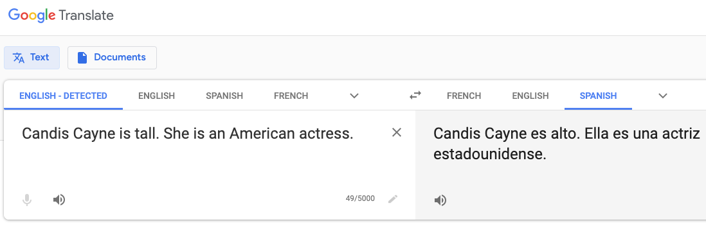

**TL;DR: I want marginalized people and communities to be recognized by those who design AI systems, and for those people's needs to be clearly communicated and understood.**

I don't talk a lot about being gay, because I'm privileged enough to work in a community where my identity isn't a problem. 
But! It does make me look at the world differently, and I've recently started thinking about issues in natural language processing that intersect with LGBTQ issues. 
What are concrete problems related to language use that relate to LGBTQ people, and how can we start talking about them in a productive way? 

AI research often focuses on building systems with a concrete task in mind (e.g. parsing sentences) rather than serving actual humans with complicated social needs, which often requires a [participatory design approach](https://en.wikipedia.org/wiki/Participatory_design) with direct input from the people affected by such systems.
In general, I think that we need a paradigm shift away from systems that address context-free problems and toward systems that **serve people**.
There is no financial benefit for someone to make an AI system that serves marginalized people.
However, helping marginalized people is how society moves forward, and we cannot pretend anymore that building systems purely for linguistic analysis or information retrieval will directly solve systemic inequalities in society.
I am not the first person to think about this issue (e.g. [Timnit Gebru](http://ai.stanford.edu/~tgebru/), [Margaret Mitchell](http://m-mitchell.com/) and [Kate Crawford](https://katecrawford.net/) have all done really impactful work about the role of AI in society), but I think that it's time that for me to stand and be counted.

After submitting an unrelated paper in September, I spent about 6 hours brain-dumping my thoughts around the issue of LGBTQ people and NLP into an abstract, which was accepted to the [NeurIPS Queer in AI workshop](https://sites.google.com/view/queer-in-ai/neurips-2019).
I'm going to present a poster about "How natural language processing can (and should) serve LGBTQ people", and I want to break it down in a blog post so it's easier to share.

## Mental health concerns

Mental health is a major concern among LGBTQ people, leading many to [depression and suicide](https://www.ncbi.nlm.nih.gov/pmc/articles/PMC4887282/).
Despite increasing social support among Americans, the [social pressure](https://www.ncbi.nlm.nih.gov/pmc/articles/PMC2072932/?iframe=true) of family and peers toward sexuality and gender identity can lead to high stress and feelings of isolation.
Due to social stigma and a lack of offline support, many LGBTQ people turn to [online discussion forums](https://dl.acm.org/citation.cfm?id=2675152) to discuss their feelings and to seek advice on navigating daily life.

While considerable work has been done to apply NLP to better [quantify mental health discussions online](http://www.munmund.net/pubs/CSCW19_MinorityStress.pdf), I would like to see NLP systems more directly applied to specific LGBTQ mental health discussions.
For example, using topic models and structured language models, can we identify consistent coming-out narratives (in the same way as e.g. [birth narratives](https://maria-antoniak.github.io/resources/2019_cscw_birth_stories.pdf)) that can then be summarized to show LGBTQ forum members that they are not alone in their experiences?
Furthermore, can we identify consistent "clusters" of LGBTQ narratives to provide to stakeholders such as [mental health counselors](https://www.crisistextline.org/) to improve their training and make them feel more confident in addressing minority experiences?
I see NLP as a useful part of an analytical toolkit to help counselors better understand the experiences of LGBTQ people.

## Social harassment

Although LGBTQ people often turn to the internet for support, they also face violent harassment from others online.
This is a huge problem on public-facing platforms such as YouTube, where LGBTQ people regularly face harassment that targets their identity expression, which is compounded by the platforms' [unfair policies with respect to content creators' rights](https://www.forbes.com/sites/rachelsandler/2019/08/14/lgbtq-creators-sue-youtube-for-alleged-discrimination/#26756886788e).
Harassment often evades typical detection systems that focus on keywords (e.g. catching the slur "f****t") through coded language or *microaggressions* that implicitly degrade people based on their identity (e.g. ["lispy queer"](https://www.washingtonpost.com/technology/2019/06/05/right-wing-youtuber-hurled-racist-homophobic-taunts-gay-reporter-company-did-nothing/)).

As noted by a [recent paper](https://www.aclweb.org/anthology/D19-1176/), these microaggressions are subtle in how they degrade people based on their identity (e.g. "my gay friend doesn't have a problem with this show").
Researchers should test the limits of current contextual language models in detecting microaggressions toward LGBTQ people and furthermore assess the harm being done to people reading such comments.
Providing further proof of the damage done through subtle examples of harassment can further justify development of systems to mitigate harassment.

## Gender bias

NLP systems such as word embeddings are often found to contain [bias toward female-associated words]((http://papers.nips.cc/paper/6228-man-is-to-computer-programmer-as-woman-is-to-homemaker-debiasing-word-embeddings.pdf)): a system trained on news text may make a flawed analogy of "man is to woman as doctor is to nurse".
While a recent wave of NLP research has focused on eliminating the female vs. male bias, there is still much to say about bias toward transgender people, as well as for people whose gender does not fit in the typical male/female binary.
One issue that transgender people face is [misgendering](https://en.wikipedia.org/wiki/Transphobia#Misgendering_and_exclusion), which can happen in a system such as Google Translate where a person's gender must be inferred by the system.
In the Google Translate example below, the American actress [Candis Cayne](https://en.wikipedia.org/wiki/Candis_Cayne) is assigned the masculine grammatical case (Spanish "alto" vs. "alta"), even when the following sentence uses a female pronoun.

If we want to prevent gender bias in NLP systems, we should audit existing systems for possible bias against transgender people and allow for the possibility of [not imposing explicit gender on the users](https://venturebeat.com/2018/12/06/google-translate-now-returns-both-feminine-and-masculine-translations-for-words-and-phrases/).

## Conversations first

In conversations with NLP researchers, I'm struck by how often people cite specific language patterns that made them excited to start working in a particular problem space: e.g. the "doctor"/"nurse" example above.
I want more of those examples to come directly from conversations with affected people, so that researchers will remember that they serve people first and abstract problems second.
Humans are not abstract mathematical representations to be optimized in a loss function.

I want researchers to **want to help**.
This will mean providing space for LGBTQ people to make their voices heard to those who have the power to design AI systems, through work like [Project Respect](https://projectrespect.withgoogle.com/).
These conversations will surely be difficult, but they will help us move toward a society where AI can serve everyone, not just the "typical" user.
If LGBTQ people will not be heard, then we will be left behind.
